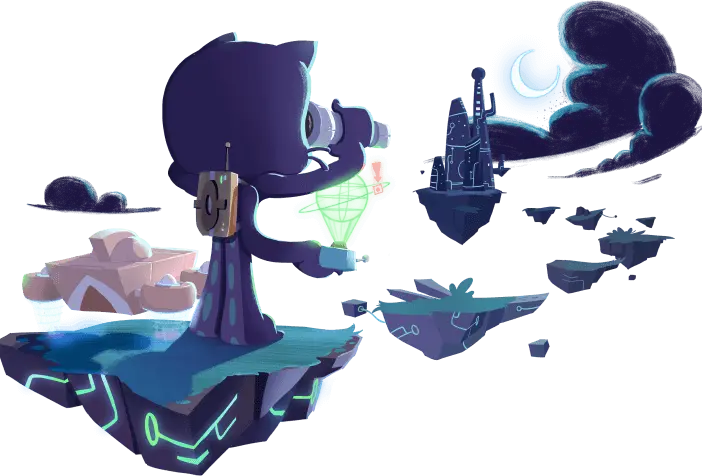

#  I am MR>Hansamala  

 

##  

  

   
    
    &nbsp;
    

 


## 📊 Stats

---
# 📫 How to reach me:

 
  
  
 
 
 ​<b>Skills :</b> <code>Python</code> | <code>HTML</code> | <code>CSS</code> | <code>SHELL</code> | <code>JavaScript</code>
  
  

  
 ​

 
 
  
## Social 📫..

    &nbsp;

### :unicorn: Repo Stats : 

---

    
&#127942 <b>GitHub Awards</b>
 

___
 

 
 ​-​  
 ​-​  

 
 ## ᴠɪssɪᴛᴏʀs ᴄᴏᴜɴᴛ
 ​
